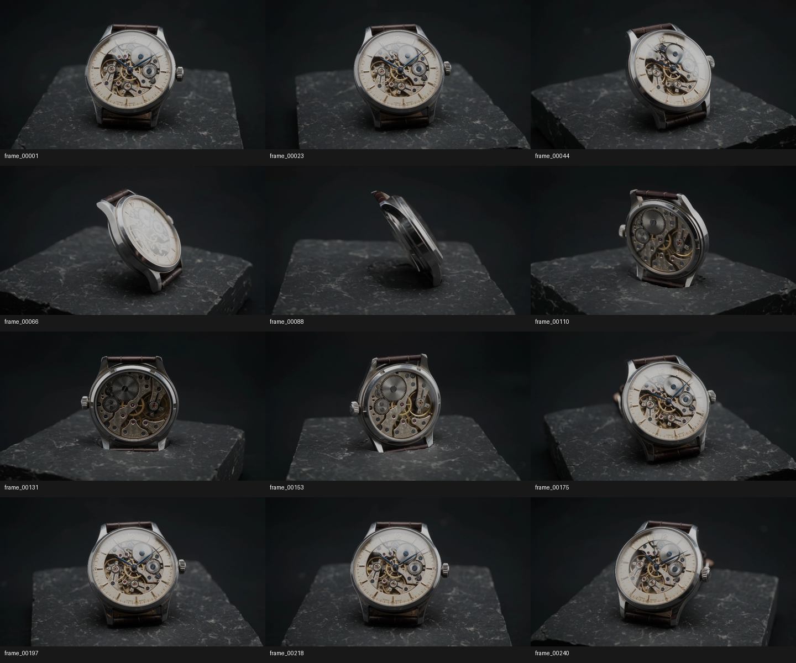
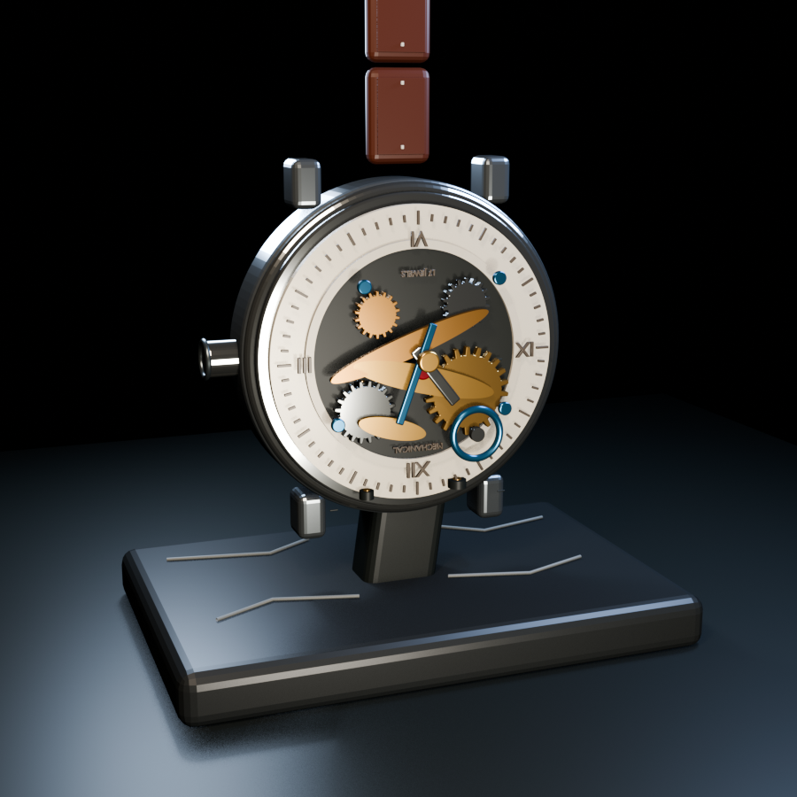
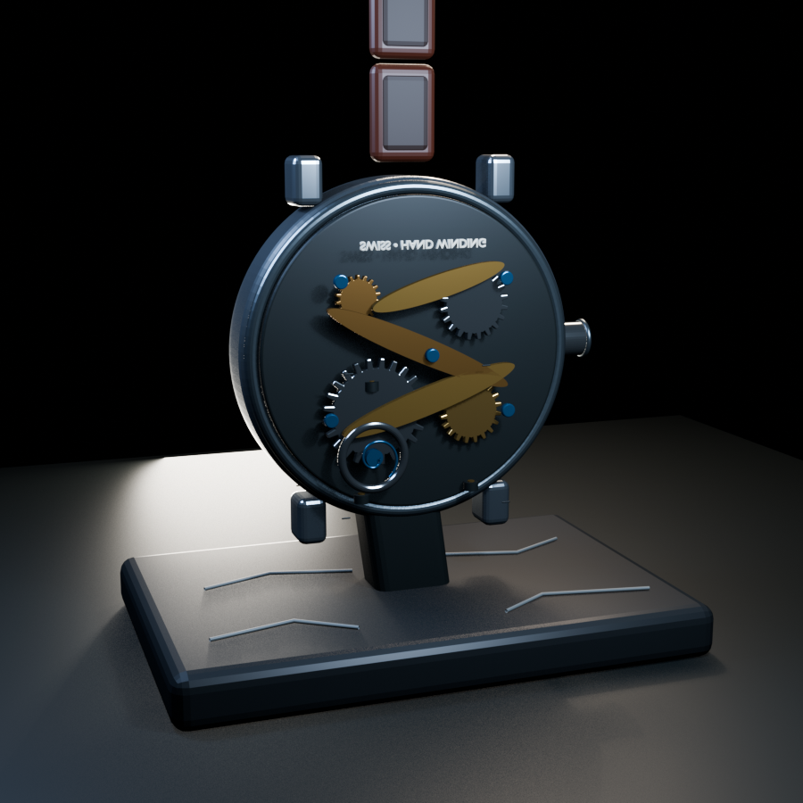

# 视频转 3D 模型（中文 Blender 插件）

一个面向 Blender 的中文插件：从视频中抽取关键帧，调用可配置的外部 AI 模型进行物体分析，并在 Blender 中生成可继续编辑的 3D 模型，最后输出 `.blend` 或 `.glb` 等格式。

> 当前版本是“AI 分析 + 程序化可编辑模型”的工作流，适合快速获得物体的主要外形。它不是完整的摄影测量或 3D Gaussian Splatting 引擎。

## 功能

- 中文界面，支持 Blender 5.2 LTS。
- 从视频自动抽取关键帧，可选择快速、均衡、精细三档质量。
- 支持聊天兼容接口：`/v1/models` 读取模型列表，`/v1/chat/completions` 调用模型。
- 支持视频上传接口，以及 Bearer、`X-API-Key`、无密钥三种认证方式。
- API 地址、模型名称和密钥由 Blender 用户偏好管理，不写入 `.blend` 项目文件，也不写入本仓库。
- 建模过程显示百分比、当前阶段、计数、耗时和实时日志。
- 每次任务创建独立项目目录，保存关键帧、状态、日志、分析结果和输出模型。
- 默认输出位置为 Windows 用户的 `下载` 文件夹，例如 `C:\Users\你的用户名\Downloads`。
- 支持输出 GLB、glTF、OBJ、FBX，并可在完成后自动导入 Blender。

## 界面预览

关键帧示例：



模型输出示例：




## 安装

1. 下载 GitHub Releases 中的 `video_to_3d_zh-v0.2.0.zip`。
2. 打开 Blender，进入 **编辑 > 偏好设置 > 插件**。
3. 点击右上角 **安装**，选择下载的 ZIP 文件。
4. 勾选 **视频转 3D 模型（中文）** 以启用插件。
5. 回到 3D 视图，按 `N` 打开侧栏，进入 **视频转3D** 标签页。

更新插件后如果侧栏仍显示旧界面，请完全退出并重新打开 Blender。

## 使用流程

1. 在“一、输入视频”中选择视频。
2. 选择质量档位和输出目录。默认输出到 Windows 的 `下载` 文件夹。
3. 在“二、外部模型接口”中填写接口 URL、接口密钥和模型名称。
4. 聊天兼容接口通常填写到 `/v1`，例如：

   ```text
   https://your-provider.example/v1
   ```

   插件会自动使用以下标准地址：

   ```text
   GET  https://your-provider.example/v1/models
   POST https://your-provider.example/v1/chat/completions
   ```

   如果误填到 `/v1/model`、`/v1/models` 或完整的 `/v1/chat/completions`，插件也会归一化到标准 `/v1` 路径。

5. 点击 **读取模型**，选择模型后点击 **使用选中模型**。
6. 点击 **保存接口配置**。勾选“保存接口密钥”后，密钥会保存到本机 Blender 用户偏好；不勾选则只在当前 Blender 会话中使用。
7. 点击 **测试接口**，确认接口可用。
8. 点击 **智能分析并建模**，等待进度完成。
9. 在“当前项目”中查看项目目录，或使用 **输出模型** 导出当前场景。

## 项目目录

每次智能建模会创建类似下面的独立目录：

```text
下载/
└─ 20260828-161100_物体名称/
   ├─ project.json                         # 项目元数据
   ├─ state.json                           # 当前/最终状态
   ├─ work/
   │  └─ frames/                           # 抽取的关键帧
   ├─ logs/
   │  └─ pipeline.log                      # 处理日志
   ├─ 视频转3D_建模参数_*.json              # AI 分析结果
   ├─ 视频转3D智能模型_*.blend              # Blender 可编辑文件
   └─ 视频转3D智能模型_*.glb                # 通用模型文件
```

## 接口约定

聊天兼容接口需要支持 OpenAI 风格的 JSON 请求，并返回 `choices[0].message.content` 或等价文本字段。插件会把关键帧信息和重建说明发送给模型，模型应返回描述物体部件的 JSON。当前程序化建模器支持的部件类型包括：盒体、圆柱、球体、圆环和圆锥。

不同供应商的模型能力、上下文长度、图片输入方式和返回格式可能不同；如果模型无法读取图片或没有返回可解析的 JSON，插件会显示错误日志。

## 安全说明

- 不要把 API 密钥写进 Python 源码、README、截图、`.blend` 文件、提交记录或 Issue。
- 不要提交 `.env`、个人配置、测试视频和生成模型文件。
- 公开发布前请运行仓库中的敏感信息检查，并确认 Git 历史中没有出现过密钥。
- 如果密钥曾经发到聊天、截图或提交记录中，请先撤销并重新生成。
- 本插件不会把密钥写入 `.blend`；“保存接口密钥”只使用 Blender 本机用户偏好设置。

## 设计来源与许可证

本项目参考 [OOOSplat](https://github.com/ooolabdev/ooosplat) 的项目化重建思路，包括独立项目目录、阶段式进度、状态文件、日志和质量档位；本仓库不包含 OOOSplat 的代码、二进制文件或资源。若未来引入第三方代码或资源，将在 `THIRD_PARTY_NOTICES.md` 中单独列明其许可证。

本项目采用 MIT License，详见 [LICENSE](LICENSE)。

## 当前限制

- 生成结果取决于视频覆盖角度、关键帧质量、模型的视觉理解能力和接口返回格式。
- 当前默认建模器生成的是可编辑的基础几何体，不保证达到工业级尺寸精度或完整材质还原。
- 大视频、慢速接口或高质量档位可能需要较长时间；进度会在等待接口时保持在当前阶段并记录状态。

## 版本

当前首个开源发布版本：`v0.2.0`。


